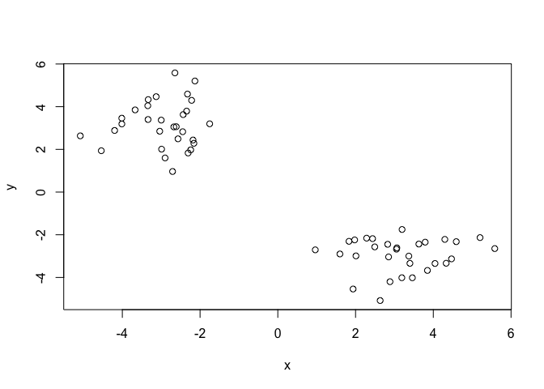
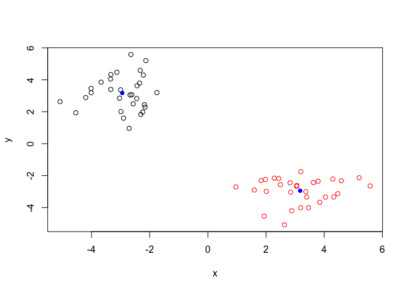
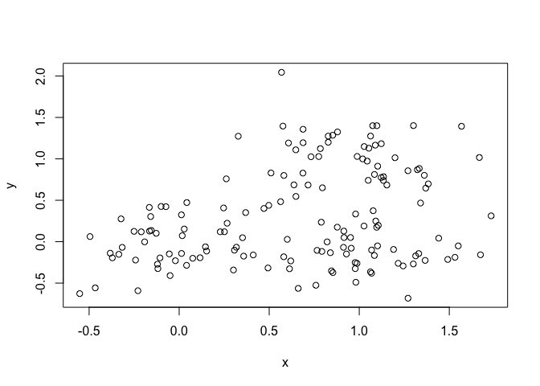
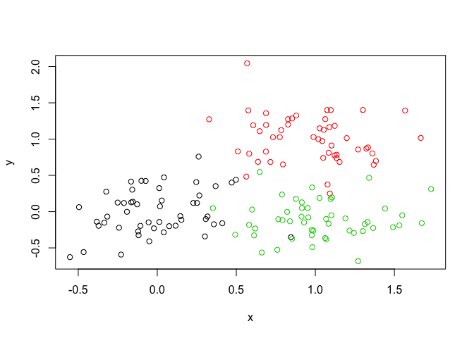
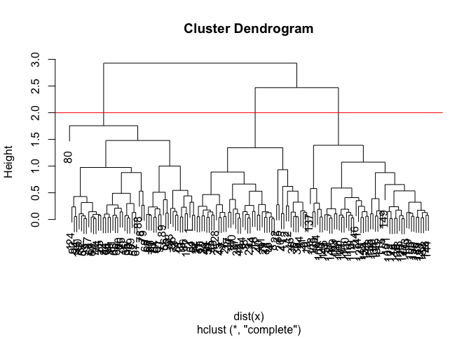
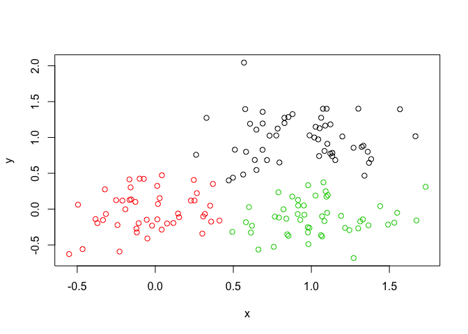

Introduction to Machine Learning for Bioinformatics
================
Julie Nguyen
October 24, 2019

K-means Clustering
==================

``` r
tmp <- c(rnorm(30,-3), rnorm(30,3))
x <- cbind(x=tmp, y=rev(tmp))

plot(x)
```



``` r
k <- kmeans(x, center=2, nstart=20)
```

``` r
k$cluster
```

    ##  [1] 1 1 1 1 1 1 1 1 1 1 1 1 1 1 1 1 1 1 1 1 1 1 1 1 1 1 1 1 1 1 2 2 2 2 2
    ## [36] 2 2 2 2 2 2 2 2 2 2 2 2 2 2 2 2 2 2 2 2 2 2 2 2 2

``` r
k$center
```

    ##           x         y
    ## 1 -2.944875  3.174754
    ## 2  3.174754 -2.944875

``` r
plot(x, col=k$cluster)
points(k$centers, col="blue", pch=16)
```



Hierarchical Clustering
=======================

The `hclust()` function requires a distance matrix as input. You can get this from the `dist()` function.

``` r
# First we need to calculate point (dis)similarity
# as the Euclidean distance between observations
dist_matrix <- dist(x)

# The hclust() function returns a hierarchical
# clustering model
hc <- hclust(d = dist_matrix)

# the print method is not so useful here
hc 
```

    ## 
    ## Call:
    ## hclust(d = dist_matrix)
    ## 
    ## Cluster method   : complete 
    ## Distance         : euclidean 
    ## Number of objects: 60

``` r
#Draw a dendogram.
plot(hc)
#The large jump in the height of the "crossbar" tells us that this tree is a good one.
abline(h=6, col="red")
```


``` r
cutree(hc, k=2) #Cuts tree into k groups.
```

    ##  [1] 1 1 1 1 1 1 1 1 1 1 1 1 1 1 1 1 1 1 1 1 1 1 1 1 1 1 1 1 1 1 2 2 2 2 2
    ## [36] 2 2 2 2 2 2 2 2 2 2 2 2 2 2 2 2 2 2 2 2 2 2 2 2 2

``` r
cutree(hc, h=6) #Cuts tree based on height.
```

    ##  [1] 1 1 1 1 1 1 1 1 1 1 1 1 1 1 1 1 1 1 1 1 1 1 1 1 1 1 1 1 1 1 2 2 2 2 2
    ## [36] 2 2 2 2 2 2 2 2 2 2 2 2 2 2 2 2 2 2 2 2 2 2 2 2 2

``` r
x <- rbind(
 matrix(rnorm(100, mean=0, sd = 0.3), ncol = 2), # c1
 matrix(rnorm(100, mean = 1, sd = 0.3), ncol = 2), # c2
 matrix(c(rnorm(50, mean = 1, sd = 0.3), # c3
 rnorm(50, mean = 0, sd = 0.3)), ncol = 2))
colnames(x) <- c("x", "y")
```

``` r
plot(x)
```



``` r
col <- as.factor(rep(c("c1","c2","c3"), each=50))
plot(x, col=col)
```



``` r
#Create hierarchical clustering of the data.
hc <- hclust(dist(x))
#Draw a tree.
plot(hc)
#Cut the tree into 3 groups.
abline(h=2, col="red")
```



``` r
grps <- cutree(hc, k=3)
#Plot according to the number of groups.
plot(x, col=grps)
```



How many points in each cluster?

``` r
table(grps)
```

    ## grps
    ##  1  2  3 
    ## 53 47 50

Cross-tabulate (i.e. compare our clustering results with the known answer.)

``` r
table(grps, col)
```

    ##     col
    ## grps c1 c2 c3
    ##    1  3 48  2
    ##    2 46  0  1
    ##    3  1  2 47

Principal Component Analysis
============================

``` r
mydata <- read.csv("https://tinyurl.com/expression-CSV",
  row.names=1)
head(mydata)
```

    ##        wt1 wt2  wt3  wt4 wt5 ko1 ko2 ko3 ko4 ko5
    ## gene1  439 458  408  429 420  90  88  86  90  93
    ## gene2  219 200  204  210 187 427 423 434 433 426
    ## gene3 1006 989 1030 1017 973 252 237 238 226 210
    ## gene4  783 792  829  856 760 849 856 835 885 894
    ## gene5  181 249  204  244 225 277 305 272 270 279
    ## gene6  460 502  491  491 493 612 594 577 618 638

How many genes are in this dataset?

``` r
nrow(mydata)
```

    ## [1] 100

Let's do PCA with the `prcomp()` function.

``` r
pca <- prcomp(t(mydata), scale=TRUE)
attributes(pca)
```

    ## $names
    ## [1] "sdev"     "rotation" "center"   "scale"    "x"       
    ## 
    ## $class
    ## [1] "prcomp"

``` r
#Basic PC1 vs. PC2 plot.
plot(pca$x[,1], pca$x[, 2])
```


``` r
#Percent variance is often more informative to look at .
pca.var <- pca$sdev^2
pca.var.per <- round(pca.var/sum(pca.var)*100, 1)

pca.var.per
```

    ##  [1] 92.6  2.3  1.1  1.1  0.8  0.7  0.6  0.4  0.4  0.0

``` r
#Scree plot.
barplot(pca.var.per, main="Scree Plot",
  xlab="Principal Component", ylab="Percent Variation")
```


Generate a PCA plot by grouping with colors.

``` r
colvec <- colnames(mydata)
colvec[grep("wt", colvec)] <- "red"
colvec[grep("ko", colvec)] <- "blue"
plot(pca$x[,1], pca$x[,2], col=colvec, pch=16,
 xlab=paste0("PC1 (", pca.var.per[1], "%)"),
 ylab=paste0("PC2 (", pca.var.per[2], "%)"))
```


``` r
#Can also generate the same plot this way:
plot(pca$x[,1], pca$x[, 2],
      col=c("red", "red", "red", "red", "red",
            "blue", "blue", "blue", "blue", "blue"))
```


PCA of UK food data
===================

``` r
x <- read.csv("UK_foods.csv")
dim(x)
```

    ## [1] 17  5

Set the row names.

``` r
#Assign the first column as the row names for the data set.
rownames(x) <- x[, 1]

#Redefine x by adding the row names to anything but the first column.
x <- x[, -1]

#The method above is dangerous because re-running this code chunk will change the dimensions of the dataset every time.
#Can also set row names with read.csv(file, row.names=1).

#Preview the first 6 rows.
head(x)
```

    ##                England Wales Scotland N.Ireland
    ## Cheese             105   103      103        66
    ## Carcass_meat       245   227      242       267
    ## Other_meat         685   803      750       586
    ## Fish               147   160      122        93
    ## Fats_and_oils      193   235      184       209
    ## Sugars             156   175      147       139

``` r
dim(x)
```

    ## [1] 17  4

Use the more robust approach to setting row names.

``` r
x <- read.csv("UK_foods.csv", row.names=1)
```

### Spotting major differences and trends.

``` r
barplot(as.matrix(x), beside=T, col=rainbow(nrow(x)))
```


``` r
#Generate a barplot with stacked bars.
barplot(as.matrix(x), beside=F, col=rainbow(nrow(x)))
```


Generate all pairwise plots.

``` r
pairs(x, col=rainbow(10), pch=16)
```


``` r
#What does it mean if a given point lies on the diagonal for a given plot?
#
#If a point lies on a diagonal, then the two countries have similar eating habits.
```

### PCA to the rescue!

``` r
pca <- prcomp(t(x))
#t argument transduces (i.e. flips) the rows and columns. We need to do this because prcomp() expects observations to be rows and variables to be columns.

summary(pca)
```

    ## Importance of components:
    ##                             PC1      PC2      PC3       PC4
    ## Standard deviation     324.1502 212.7478 73.87622 4.189e-14
    ## Proportion of Variance   0.6744   0.2905  0.03503 0.000e+00
    ## Cumulative Proportion    0.6744   0.9650  1.00000 1.000e+00

``` r
#Proportion of Variance tells us how much each PC accounts for in the total 17-dimension variance. Cumulative Proportion will tell us how much each group of PC accounts for in the total 17-dimension variance.
```

Generate a plot of PC1 vs. PC2.

``` r
plot(pca$x[, 1], pca$x[, 2], xlab="PC1", ylab="PC2", xlim=c(-270,500))
```


