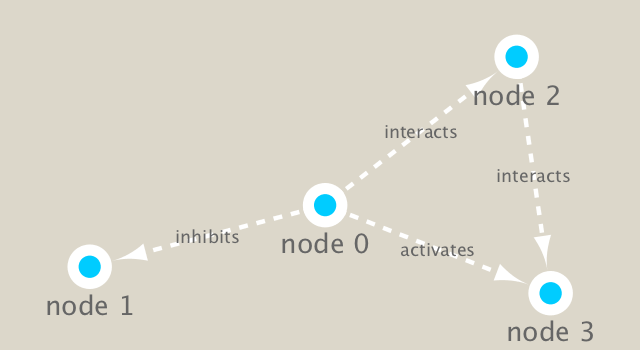

```{r setup, include=FALSE}
knitr::opts_chunk$set(echo = TRUE)
```
Examine data from the Tara Ocean project on bacteria in ocean water samples from around the world.

#Set up Cytoscape and R connection

We will use the **igraph** package from CRAN and the **RCy3** pacakage from bioconductor to build and visualize networks of these data.

```{r}
#Load packages.
library(RCy3)
library(igraph)
library(RColorBrewer)
library(BBmisc)
```

```{r}
#Test the connection to Cytoscape.
cytoscapePing()
```

We can test things further by making a small network (here in igraph format as used by the R igraph package) and sending it to Cytoscape.

```{r}
g <- makeSimpleIgraph()
createNetworkFromIgraph(g,"myGraph")
```

We can include this Cytoscape rendered network image in our report. Cytoscape provides a number of canned visual styles. The code below explores some of these styles. For example check out the **marquee** style!

```{r}
setVisualStyle("Marquee")
```

```{r}
fig <- exportImage(filename="demo_marquee", type="png", height=350)

```

#Read our metagenomics data

We will read in a species co-occurrence matrix that was calculated using Spearman Rank coefficient. 

```{r}
#Scripts for processing located in "inst/data-raw/".
prok_vir_cor <- read.delim("virus_prok_cor_abundant.tsv", stringsAsFactors = FALSE)

#Have a peak at the first 6 rows.
head(prok_vir_cor)
```

Here we will use the igraph package to convert the co-occurrence dataframe into a network that we can send to Cytoscape. In this case our graph is undirected (so we will set `directed = FALSE`) since we do not have any information about the direction of the interactions from this type of data.

```{r}
g1 <- graph.data.frame(prok_vir_cor, directed = FALSE)
class(g1)
g1
```

In this case the first line of output (“UNW- 854 1544 –”) tells that our network graph has 845 vertices (i.e. nodes, which represent our bacteria and viruses) and 1544 edges (i.e. linking lines, which indicate their co-occurrence). Note that the first four characters (i.e. the “UNW-” part) tell us about the network setup. In this case our network is Undirected, Named (i.e. has the ‘name’ node/vertex attribute set) and Weighted (i.e. the ‘weight’ edge attribute is set).

```{r}
#Plotting g1 alone is a hot mess. Vertex labels are automatically shown and the default vertex size is 15.
plot(g1, vertex.size=3, vertex.label=NA)
```

##Network querys

Note that we can query (and set) vertex and edge attributes with the V() and E() functions respectively.

```{r}
V(g1)
E(g1)
```

##Network community detection

Community structure detection algorithms try to find dense sub-graphs within larger network graphs (i.e. clusters of well connected nodes that are densely connected themselves but sparsely connected to other nodes outside the cluster) . Here we use the classic Girvan & Newman betweenness clustering method. The igraph package has lots of different community detection algorithms (i.e. different methods for finding communities).

```{r}
cb <- cluster_edge_betweenness(g1)
cb
```

```{r}
plot(cb, y=g1, vertex.label=NA,  vertex.size=3)
```

You can extract a cluster/community membership vector for further inspection with the `membership()` function:

```{r}
head(membership(cb))
```

##Node degree

The degree of a node or vertex is its most basic structural property, the number of its adjacent edges. Here we calculate and plot the node degree distribution.

```{r}
#Calculate and plot node degree of our network.
d <- degree(g1)
hist(d, breaks=30, col="lightblue", main ="Node Degree Distribution")
```

For the `degree_distribution()` function a numeric vector of the same length as the maximum degree plus one is returned. The first element is the relative frequency zero degree vertices, the second vertices with degree one, et

```{r}
plot(degree_distribution(g1), type="h")
```

##Centrality analysis

Centrality gives an estimation on how important a node or edge is for the connectivity (or the information flow) of a network. It is a particularly useful parameter in signaling networks and it is often used when trying to find drug targets for example.

Centrality analysis often aims to answer the following question: Which nodes are the most important and why?

```{r}
pr <- page_rank(g1)
head(pr$vector)
```

Lets plot our network with nodes size scaled via this page rank centrality scores.

```{r}
# Make a size vector btwn 2 and 20 for node plotting size.
v.size <- BBmisc::normalize(pr$vector, range=c(2,20), method="range")
plot(g1, vertex.size=v.size, vertex.label=NA)
```

One of the simplest centrality scores is of course degree that we calculated previously and stored as the object `d`. Lets plot this one out also.

```{r}
v.size <- BBmisc::normalize(d, range=c(2,20), method="range")
plot(g1, vertex.size=v.size, vertex.label=NA)
```

Another very common centrality score is betweenness. The vertex and edge betweenness are (roughly) defined by the number of geodesics (shortest paths) going through a vertex or an edge.

```{r}
b <- betweenness(g1)
v.size <- BBmisc::normalize(b, range=c(2,20), method="range")
plot(g1, vertex.size=v.size, vertex.label=NA)
```