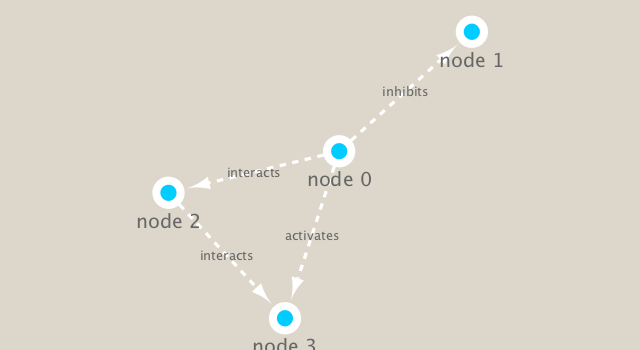

Biological Network Analysis
================

Examine data from the Tara Ocean project on bacteria in ocean water samples from around the world.

Set up Cytoscape and R connection
=================================

We will use the **igraph** package from CRAN and the **RCy3** pacakage from bioconductior to build and visualize networks of these data.

``` r
#Load packages.
library(RCy3)
```

    ## Warning: package 'RCy3' was built under R version 3.6.1

``` r
library(igraph)
```

    ## 
    ## Attaching package: 'igraph'

    ## The following objects are masked from 'package:stats':
    ## 
    ##     decompose, spectrum

    ## The following object is masked from 'package:base':
    ## 
    ##     union

``` r
library(RColorBrewer)
```

``` r
#Test the connection to Cytoscape.
cytoscapePing()
```

    ## [1] "You are connected to Cytoscape!"

We can test things further by making a small network (here in igraph format as used by the R igraph package) and sending it to Cytoscape.

``` r
g <- makeSimpleIgraph()
createNetworkFromIgraph(g,"myGraph")
```

    ## Loading data...
    ## Applying default style...
    ## Applying preferred layout...

    ## networkSUID 
    ##          80

We can include this Cytoscape rendered network image in our report with the following code:

``` r
fig <- exportImage(filename="demo", type="png", height=350)
```

    ## Warning: This file already exists. A Cytoscape popup 
    ##                 will be generated to confirm overwrite.

``` r

```


Cytoscape provides a number of canned visual styles. The code below explores some of these styles. For example check out the marquee style!

``` r
setVisualStyle("Marquee")
```

    ##                 message 
    ## "Visual Style applied."

``` r
fig <- exportImage(filename="demo_marquee", type="png", height=350)
```

    ## Warning: This file already exists. A Cytoscape popup 
    ##                 will be generated to confirm overwrite.

``` r
knitr::include_graphics("./demo_marquee.png")
```


